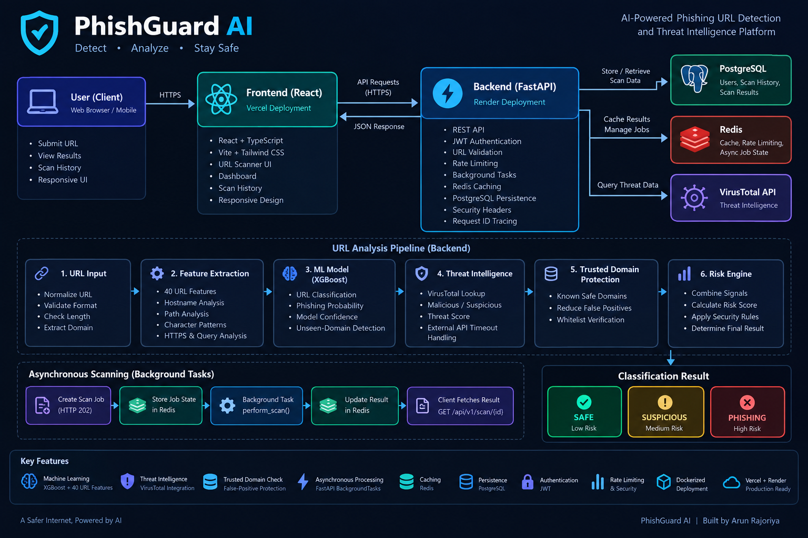
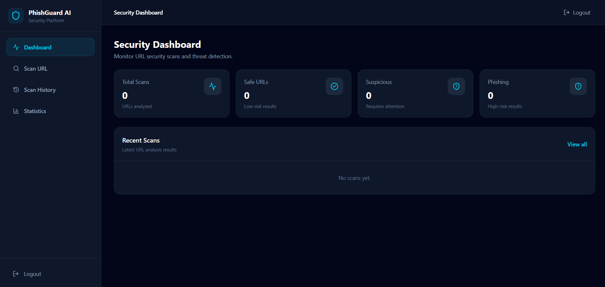
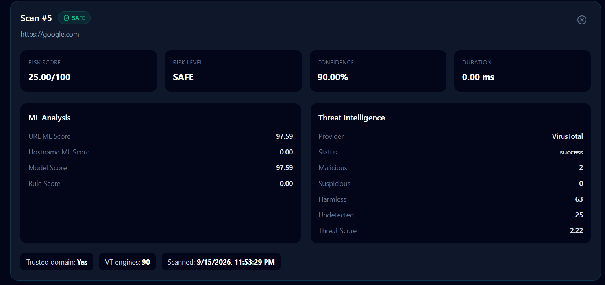
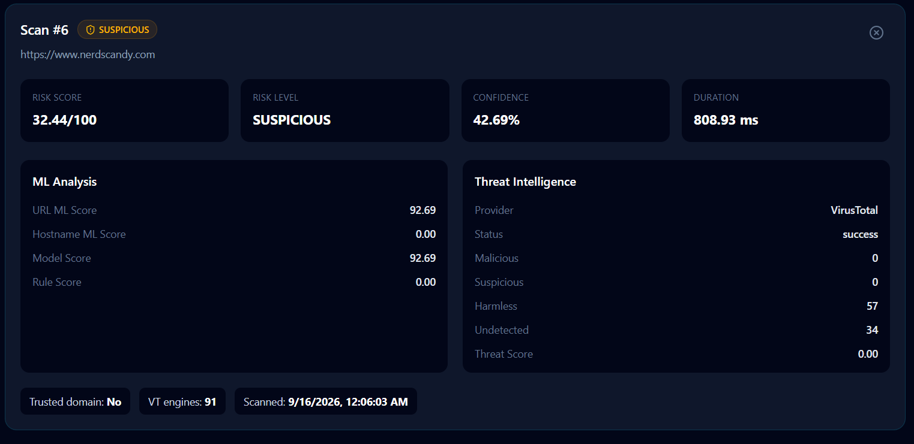
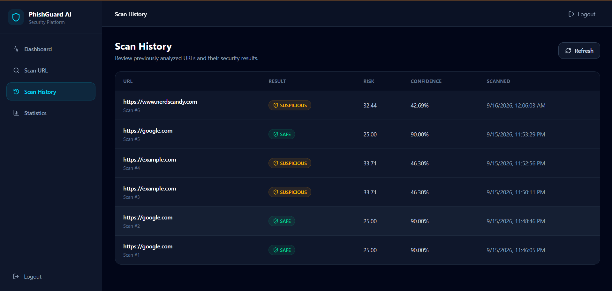

# 🛡️ PhishGuard AI

### AI-Powered Phishing URL Detection & Threat Intelligence Platform

PhishGuard AI is a production-oriented security platform that analyzes URLs using machine learning, threat intelligence, trusted-domain protection, risk scoring, Redis caching, PostgreSQL persistence, JWT authentication, and asynchronous background processing.

🔗 **Live Demo:** https://phish-guard-ai-gamma.vercel.app/

🔗 **Backend API:** https://phishguard-ai-g1pz.onrender.com/

🔗 **GitHub:** https://github.com/ArunRajoriya/PhishGuard-AI

---

## 🚀 Overview

Phishing attacks frequently rely on deceptive URLs to trick users into revealing credentials or sensitive information.

PhishGuard AI provides a layered URL analysis pipeline that combines:

- Machine learning
- URL feature engineering
- Threat intelligence
- Trusted-domain verification
- Risk scoring
- Redis caching
- PostgreSQL persistence
- JWT authentication
- API rate limiting
- Asynchronous scan processing

The system classifies URLs into:

- 🟢 **SAFE**
- 🟡 **SUSPICIOUS**
- 🔴 **PHISHING**

The goal is not simply to run an ML model, but to demonstrate how an ML capability can be integrated into a production-style software system.

---

# ✨ Key Features

### 🤖 Machine Learning

- Domain-generalized phishing URL detection
- XGBoost-based URL classification
- 40 URL-derived features
- URL normalization and feature extraction
- Unseen-domain evaluation
- Model confidence and score reporting

### 🛡️ Security Intelligence

- VirusTotal threat intelligence integration
- Trusted-domain protection
- Multi-signal risk evaluation
- False-positive protection
- SAFE / SUSPICIOUS / PHISHING classification

### ⚡ Backend Engineering

- FastAPI REST API
- JWT authentication
- PostgreSQL persistence
- Redis caching
- Redis-backed asynchronous job state
- FastAPI BackgroundTasks
- API rate limiting
- Request ID tracing
- External API timeout protection
- Input validation
- Security headers

### 🎨 Frontend

- React
- TypeScript
- Vite
- Tailwind CSS
- Axios
- Responsive dashboard
- URL scanning interface
- Scan history
- Detailed scan results

### ☁️ Deployment

- Frontend deployed on Vercel
- Backend deployed on Render
- PostgreSQL database
- Redis cache
- Dockerized backend
- GitHub-based deployment workflow

---

# 🧠 Machine Learning

PhishGuard AI uses URL-based machine learning to identify phishing patterns without requiring the destination website to be opened.

The production URL model uses 40 engineered URL features including characteristics related to:

- URL length
- Hostname length
- Path length
- Slash count
- HTTPS usage
- Query parameters
- Special characters
- URL structure
- Character ratios
- Hostname characteristics

## Model Evaluation

The model was evaluated using domain-based splitting to reduce leakage between training and unseen domains.

### Unseen-Domain Performance

| Metric | Result |
|---|---:|
| F1 Score | 99.82% |
| ROC-AUC | 99.86% |

The unseen-domain evaluation is important because phishing URLs from the same domains appearing in both training and testing can produce overly optimistic results.

---

# 🔍 Scan Pipeline

```text
                   URL
                    │
                    ▼
             URL Normalization
                    │
                    ▼
             Input Validation
                    │
                    ▼
             Feature Extraction
                    │
                    ▼
             ┌───────────────┐
             │   URL Model   │
             │   XGBoost     │
             └───────┬───────┘
                     │
          ┌──────────┴──────────┐
          │                     │
          ▼                     ▼
 Threat Intelligence      Trusted Domain
      VirusTotal             Check
          │                     │
          └──────────┬──────────┘
                     ▼
                Risk Engine
                     │
          ┌──────────┼──────────┐
          ▼          ▼          ▼
        SAFE     SUSPICIOUS   PHISHING
          │          │          │
          └──────────┼──────────┘
                     ▼
              Redis Cache
                     │
                     ▼
               PostgreSQL
                     │
                     ▼
               API Response
```

---
## Architecture



For a detailed explanation of the architecture and request flows, see [`docs/architecture.md`](docs/architecture.md).

# 🏗️ System Architecture

```text
                         ┌──────────────────────┐
                         │    React Frontend    │
                         │   Vercel Deployment  │
                         └──────────┬───────────┘
                                    │ HTTPS
                                    ▼
                         ┌──────────────────────┐
                         │      FastAPI         │
                         │    Render Service    │
                         └──────────┬───────────┘
                                    │
          ┌─────────────────────────┼─────────────────────────┐
          │                         │                         │
          ▼                         ▼                         ▼
   ┌──────────────┐        ┌────────────────┐        ┌──────────────┐
   │ JWT Security │        │     Redis      │        │ PostgreSQL   │
   │     Auth     │        │ Cache + Jobs   │        │ Scan History │
   └──────────────┘        └───────┬────────┘        └──────────────┘
                                    │
                                    ▼
                         ┌──────────────────────┐
                         │ FastAPI Background   │
                         │       Tasks          │
                         └──────────┬───────────┘
                                    │
                ┌───────────────────┼───────────────────┐
                │                   │                   │
                ▼                   ▼                   ▼
        ┌──────────────┐    ┌──────────────┐    ┌──────────────┐
        │ URL Feature  │    │ XGBoost URL  │    │ VirusTotal   │
        │ Extraction   │    │    Model     │    │ Threat Intel │
        └──────────────┘    └──────────────┘    └──────────────┘
                                    │
                                    ▼
                         ┌──────────────────────┐
                         │     Risk Engine      │
                         │ SAFE / SUSPICIOUS /  │
                         │       PHISHING       │
                         └──────────────────────┘
```

---

# ⚡ Asynchronous Scanning

PhishGuard AI supports asynchronous URL scanning using FastAPI BackgroundTasks.

```text
Client
  │
  │ POST /api/v1/scan/async
  ▼
FastAPI
  │
  ├── Create scan job
  │
  ├── Store job state in Redis
  │
  └── Return HTTP 202
          │
          ▼
   Background Task
          │
          ▼
      perform_scan()
          │
          ▼
      Update Redis
          │
          ▼
   status = completed
          │
          ▼
GET /api/v1/scan/{scan_id}
```

This allows the API to acknowledge the scan request without requiring a separate worker service.

---

# 🗄️ Data & Caching

## PostgreSQL

Used for persistent application data including:

- Users
- Scan history
- Scan results

## Redis

Used for:

- Scan result caching
- Asynchronous job state
- Rate limiting

Caching repeated URL scans reduces unnecessary ML and external threat-intelligence processing.

---

# 🔐 Security

PhishGuard AI includes multiple application-level security controls:

- JWT-based authentication
- Protected API endpoints
- Request validation
- URL length limits
- Invalid URL rejection
- Rate limiting
- SQL injection-resistant database operations
- External API timeout protection
- Security response headers
- Request ID tracing
- Redis failure-tolerant behavior
- Secrets stored through environment variables

Secrets such as API keys, JWT secrets and database credentials are intentionally excluded from source control.

---

# 🧪 Testing

The backend has been tested across multiple production-oriented scenarios.

### Current test coverage

- Authentication
- Authorization
- URL validation
- Synchronous scanning
- Asynchronous scanning
- Redis caching
- PostgreSQL persistence
- Rate limiting
- Concurrent requests
- External API timeout handling
- Redis failure handling
- Malicious input handling
- Security headers

### Automated Tests

**98 tests passing**

Additional production sanity checks were performed for concurrency, rate limiting, Redis failure tolerance and deployed API behavior.

---

# 🛠️ Technology Stack

## Backend

- Python
- FastAPI
- SQLAlchemy
- PostgreSQL
- Redis
- JWT
- Pydantic

## Machine Learning

- XGBoost
- Scikit-learn
- Pandas
- NumPy

## Frontend

- React
- TypeScript
- Vite
- Tailwind CSS
- Axios
- Recharts

## DevOps & Infrastructure

- Docker
- Git
- GitHub
- Vercel
- Render

## Threat Intelligence

- VirusTotal API

---

# 📁 Project Structure

```text
PhishGuard-AI/
│
├── frontend/
│   ├── src/
│   ├── public/
│   ├── package.json
│   └── ...
│
├── model/
│   ├── domain_url_model.pkl
│   └── domain_feature_schema.json
│
├── jobs/
│   ├── scan_queue.py
│   └── worker.py
│
├── utils/
│   └── url_normalizer.py
│
├── docs/
│   ├── architecture.md
│   └── deployment.md
│
├── app.py
├── predictor.py
├── feature_extractor.py
├── auth.py
├── risk_engine.py
├── Dockerfile
├── requirements.txt
├── .gitignore
└── README.md
```

---

# ☁️ Production Deployment

### Frontend

**Vercel**

https://phish-guard-ai-gamma.vercel.app/

### Backend

**Render**

https://phishguard-ai-g1pz.onrender.com/

### Database

PostgreSQL

### Cache

Redis

### Containerization

Docker

---

# ⚙️ Local Development

## 1. Clone

```bash
git clone https://github.com/ArunRajoriya/PhishGuard-AI.git
cd PhishGuard-AI
```

## 2. Create virtual environment

```bash
python -m venv venv
```

### Windows

```powershell
.\venv\Scripts\Activate.ps1
```

## 3. Install dependencies

```bash
pip install -r requirements.txt
```

## 4. Configure environment variables

Create a `.env` file:

```env
DATABASE_URL=your_database_url
REDIS_URL=your_redis_url
JWT_SECRET_KEY=your_secret
VIRUSTOTAL_API_KEY=your_api_key
```

Never commit `.env` to Git.

## 5. Run backend

```bash
uvicorn app:app --reload
```

Backend:

```text
http://localhost:8000
```

## 6. Run frontend

```bash
cd frontend
npm install
npm run dev
```

---

# 🔌 API

### Authentication

```text
POST /api/v1/auth/register
POST /api/v1/auth/login
GET  /api/v1/auth/me
```

### Scanning

```text
POST /api/v1/scan
POST /api/v1/scan/async
GET  /api/v1/scan/{scan_id}
```

### History

```text
GET /api/v1/history
```

Protected endpoints require:

```text
Authorization: Bearer <JWT>
```

---

# 📊 Example Results

### SAFE

```text
URL: https://google.com

Risk Score: 25/100
Risk Level: SAFE
Confidence: 90%

Trusted Domain: Yes
Cache: Redis
```

### SUSPICIOUS

```text
URL: https://www.nerdscandy.com

Risk Score: 32.44/100
Risk Level: SUSPICIOUS
Confidence: 42.69%

URL ML Score: 92.69
Trusted Domain: No
```

---


# 📸 Screenshots

### Security Dashboard



### SAFE URL Detection



### SUSPICIOUS URL Detection



### Scan History



---

# 🎯 Engineering Highlights

PhishGuard AI was designed to demonstrate practical software engineering concepts beyond machine learning:

- REST API design
- Authentication and authorization
- Database persistence
- Caching
- Asynchronous processing
- Rate limiting
- Failure handling
- External API integration
- Containerization
- Cloud deployment
- Frontend/backend integration
- ML model serving

---

# 🚧 Project Status

**Production demo deployed and operational.**

Core scanning, authentication, persistence, caching, asynchronous processing and frontend/backend integration have been validated in the deployed environment.

---

# 👨‍💻 Author

### Arun Rajoriya

Software Developer | Backend | AI/ML | Full Stack

GitHub:  
https://github.com/ArunRajoriya

---

## ⭐ If you find this project useful

Consider giving the repository a star.